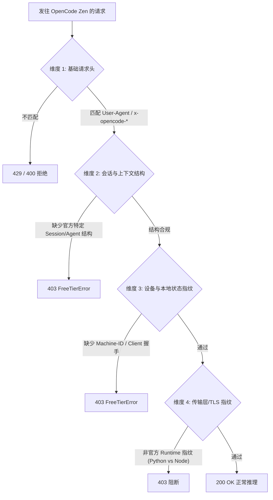

# OpenCode 免费模型外接与本地网关架构计划

> **目标**：突破 OpenCode 客户端校验限制，将 OpenCode 内置的免费模型（如 `mimo-v2.6-flash-free`、`space-bunny-free`、`deepseek-v4-flash-free` 等）接入本地全栈网关，转换为标准 OpenAI (`/v1/chat/completions`) 与 Anthropic (`/v1/messages`) 协议，供 Cursor、Claude Code 等外部开发工具无感调用。

---

## 一、 背景与现状剖析

### 1.1 痛点与核心矛盾
* **认证不是壁垒**：OpenCode 的认证信息明文保存在本地 `~/.local/share/opencode/auth.json` 中，包含可用的 API Key。
* **服务端实施强客户端准入（Client Attestation）**：
  * OpenCode Zen 从 2026 年 9 月起强化了免费层风控，对于第三方脚本、代理（如 LiteLLM）发起的请求直接拦截。
  * 拦截表现为：`HTTP 403 Forbidden: {"type":"FreeTierError","message":"OpenCode's free tier can only be used from within OpenCode"}`。
* **差异化校验现象（实测验证）**：
  * **轻校验模型**（如 `space-bunny-free`）：只需构造合规的 `User-Agent` 与基础 `x-opencode-*` 头部即可成功 200 交互并生成文本。
  * **重校验模型**（如 `mimo-v2.6-flash-free`）：即使携带常规 Header 仍被判定为非官方客户端，命中 `FreeTierError`。

---

## 二、 客户端判定机制深度解构

服务端判定“来自自家官方客户端”通常依托以下四个维度的指纹特征组合：



1. **协议层与元数据**：
   * `User-Agent`: 严格匹配 `opencode/<version>/<client>`（如 `opencode/1.18.30/cli`）。
   * 私有头部链：`x-opencode-client`, `x-opencode-version`, `x-opencode-session`, `x-opencode-project`, `x-opencode-request`。
2. **上下文语义契约**：
   * 官方客户端在发送时包含特定的系统角色（System Prompt）模板或内建 Agent 描述，缺乏这些特征会被标记为外部裸调用。
3. **传输层/运行时指纹**：
   * OpenCode 基于 Node/TypeScript 构建，其 TLS Client Hello 特征（Cipher Suites、Extensions 顺序）与 Node 原生 `fetch` 绑定；使用标准 Python `urllib` / `requests` 容易在网关层被标记异常。

---

## 三、 三套实施路线对比与技术选型

针对“必须来自自家客户端”的约束，规划三套技术路线：

| 路线方案 | 原理 | 优势 | 劣势 / 风险 | 推荐指数 |
| :--- | :--- | :--- | :--- | :---: |
| **路线 A：协议级特征逆向伪装 (Pure Spoofing)** | 通过抓包分析正版客户端交互报文，在 Python 网关中 1:1 模拟其完整的 Headers、TLS 指纹 (`curl_cffi`) 及 Payload 结构。 | 独立运行，不依赖后台常驻 OpenCode 客户端进程。 | 官方服务端特征升级时需重新抓包逆向，维护成本高。 | ★★★☆☆ |
| **路线 B：本地 Sidecar / 进程级中继 (Process Bridge)** | **借壳生蛋**：网关接收外部请求，转换为本地指令打给正在运行的 OpenCode 本地 Server/Sidecar，借用官方合法通道通信。 | 100% 官方正版握手与指纹，天然免封、免逆向加密细节。 | 依赖本机已安装并运行 OpenCode 客户端。 | ★★★★★ |
| **路线 C：Plugin 内存注入网关 (Plugin Hook)** | 在 `~/.config/opencode/plugins/` 编写常驻插件，在 OpenCode 进程内开启轻量 HTTP Server，直接调用内部 Runtime 导出 API。 | 完美利用官方插件机制，侵入性极低，开发工作量小。 | 仅在 OpenCode 启动时提供服务。 | ★★★★☆ |

### 推荐演进策略：
1. **阶段 1 优先攻坚【路线 B/C】（稳妥与高可用）**：
   利用本机已装好的 OpenCode Desktop / CLI 运行时，通过本地插件或 Sidecar 接口打通双向流式转接，最快让 Cursor / Claude Code 享受 `mimo-v2.6-flash-free` 等完整免费模型能力。
2. **阶段 2 同步推进【路线 A】（便携与轻量）**：
   抓包分析重校验模型与轻校验模型（如已跑通的 `space-bunny-free`）的报文差异，提取出核心缺失特征，逐步将网关解耦为独立直连模式。

---

## 四、 系统整体架构设计

```mermaid
flowchart LR
    subgraph Clients [外部调用端]
        Cursor[Cursor IDE]
        ClaudeCode[Claude Code]
        CustomSDK[OpenAI SDK / Python]
    end

    subgraph LocalGateway [X_Project 本地网关 (端口 8790)]
        Router[API 路由器]
        Converter[协议双向转换器<br>OpenAI / Anthropic 流式转接]
        AuthMgr[凭据加载器<br>读取 auth.json]
    end

    subgraph BridgeEngine [接入引擎]
        direction TB
        ModeA[模式 A: 纯伪装直连引擎<br>(带 TLS 指纹与合规 Payload)]
        ModeB[模式 B: 本地 OpenCode 插件/进程桥接]
    end

    subgraph Upstream [官方服务端]
        ZenAPI[OpenCode Zen API<br>https://opencode.ai/zen/v1]
    end

    Cursor -->|/v1/chat/completions| Router
    ClaudeCode -->|/v1/messages| Router
    CustomSDK -->|/v1/*| Router

    Router --> Converter
    AuthMgr --> Converter
    Converter --> ModeA
    Converter --> ModeB

    ModeA -->|直连 HTTP| ZenAPI
    ModeB -->|本地 IPC / Plugin Hook| ZenAPI
```

---

## 五、 详细实施执行阶段规划

### 阶段一：抓包分析与特征比对（Day 1）
* **任务 1.1**：配置本地抓包环境（使用 mitmproxy 或 Windows 本地代理），捕获 OpenCode Desktop / CLI 请求 `mimo-v2.6-flash-free` 时的原始报文。
* **任务 1.2**：比对当前已验证成功的 `space-bunny-free` 报文与失败报文的差异（重点核对 Header 顺序、TLS JA3 指纹、Session/Message 嵌套结构）。
* **产出**：`D:\Projects\X_Project\research\network_dump_analysis.md`。

### 阶段二：本地进程桥接与插件验证（Day 2）
* **任务 2.1**：基于 `~/.config/opencode/plugins/` 编写测试插件 `gateway-bridge.ts`，验证能否在插件生命周期内直接调用官方 Provider 发起对话。
* **任务 2.2**：测试 OpenCode 原生 headless/server 模式（如 `opencode server` 的内置端点），验证其本地 REST 路由与流式转发能力。
* **产出**：可工作的本地调用 PoC 脚本。

### 阶段三：网关核心开发与协议转接（Day 3）
* **任务 3.1**：搭建设立网关主干（基于 FastAPI / Uvicorn，复用并优化当前成熟的流式 IR 转换模型）。
* **任务 3.2**：实现 `/v1/chat/completions` 与 `/v1/models` 端点。
* **任务 3.3**：实现 `/v1/messages` (Anthropic 格式)，确保兼容 Claude Code。
* **任务 3.4**：实现 SSE 流式 Chunk 实时推送与错误回退（自动降级与模型重试）。

### 阶段四：联调验证与客户端适配（Day 4）
* **任务 4.1**：在 Cursor 中配置 `http://127.0.0.1:8790/v1`，验证代码补全与 Agent 对话。
* **任务 4.2**：在 Claude Code 中通过环境变量对接 `/v1/messages`，验证多轮 Tool Call 兼容性。
* **任务 4.3**：编写一键启动脚本与守护进程配置。

---

## 六、 风险评估与应对措施

| 风险点 | 影响程度 | 应对措施 |
| :--- | :---: | :--- |
| **官方升级指纹校验** | 中 | 默认采用“路线 B/C（本地中继/插件）”，所有请求由官方正版进程发起，免疫服务端反爬变动。 |
| **免费模型频控 (Rate Limit)** | 中 | 网关层内置 Session 自动轮转与请求间隔削峰，遇到 429 自动降级至备选可用免费模型。 |
| **上下文格式不兼容** | 低 | 在网关 IR 层增加清洗逻辑，补齐 OpenCode 预期的角色标识与结构化字段。 |

---

## 七、 交付清单

1. `PLAN.md`：本技术架构与实施规划。
2. `app/`：本地全栈网关源代码（支持 OpenAI/Anthropic 协议转换与 OpenCode 上游桥接）。
3. `plugins/`（或 `bridge/`）：OpenCode 本地进程桥接/插件脚本。
4. `start.bat` / `start.sh`：一键启动脚本。
5. `README.md`：Cursor / Claude Code 快速配置说明指南。
